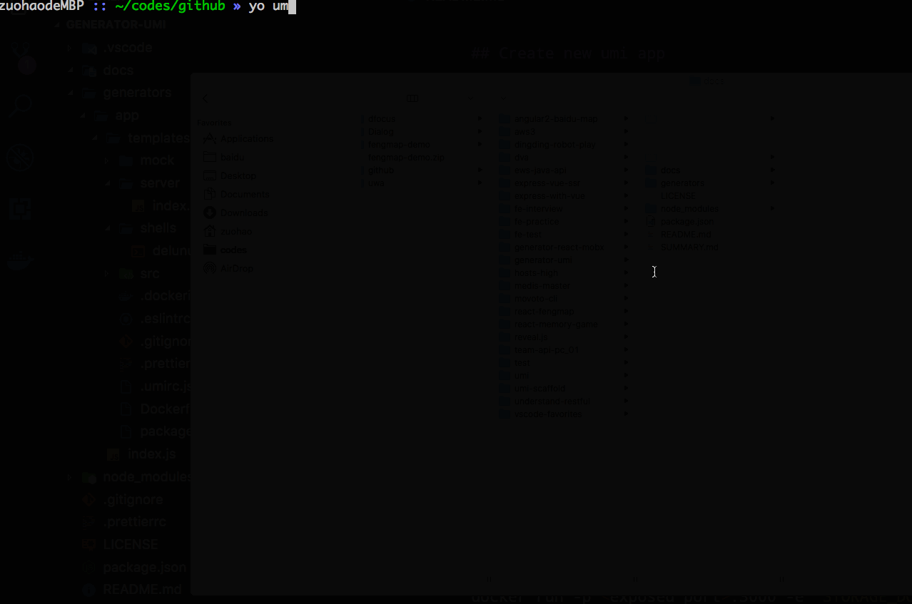

# generator-umi

[![NPM version][npm-image]][npm-url]
![][david-url]
![][dt-url]
![][license-url]

Yeoman generator for umi project

> Read documentation here: [https://leftstick.gitbook.io/generator-umi](https://leftstick.gitbook.io/generator-umi)



# Installation

```bash
sudo npm install -g yo generator-umi
```

# Usage

## Create new umi app

```bash
yo umi
```

> answer questions `generator-umi` required

**Nice work**

## Start debugging

```bash
npm start
```

## Release with builtin node server

### .zip pattern

```bash
bash shells/build.sh
```

> `.zip` generated at root folder

### docker pattern

```bash
bash shells/build.sh && docker build --no-cache -t <app-name>:<tag>
```

> find generated image via `docker image ls`

## LICENSE

[MIT License](https://raw.githubusercontent.com/DFocusGroup/generator-umi/master/LICENSE)

[npm-url]: https://npmjs.org/package/generator-umi
[npm-image]: https://badge.fury.io/js/generator-umi.png
[david-url]: https://david-dm.org/DFocusGroup/generator-umi.png
[dt-url]: https://img.shields.io/npm/dt/generator-umi.svg
[license-url]: https://img.shields.io/npm/l/generator-umi.svg
